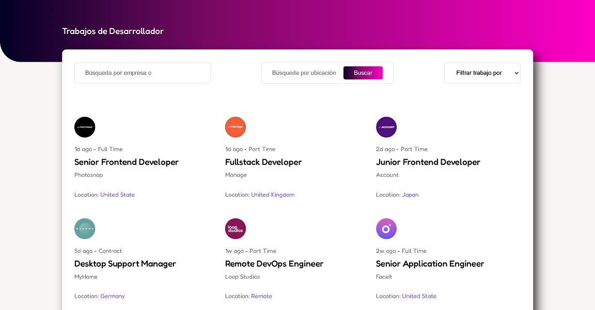
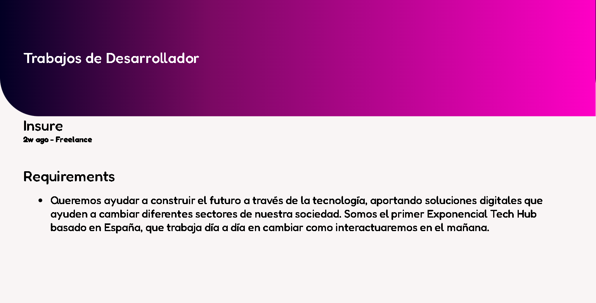

# React - Fundamentos

## Tecnologías Utilizadas:

- React (Routes, useState, useEffect, useParams)
- ViteJs
- Git

---
## Descripción 📘 

Proyecto para practicar el uso de filters en React, uso de Hooks, uso de Routes y components.
En esta oportunidad simulando una base de datos dentro del propio proyecto con el cual ponemos en práctica el uso de los filtros de acuerdo a la información solicitada.

---
## Vista Principal 🎨
---

